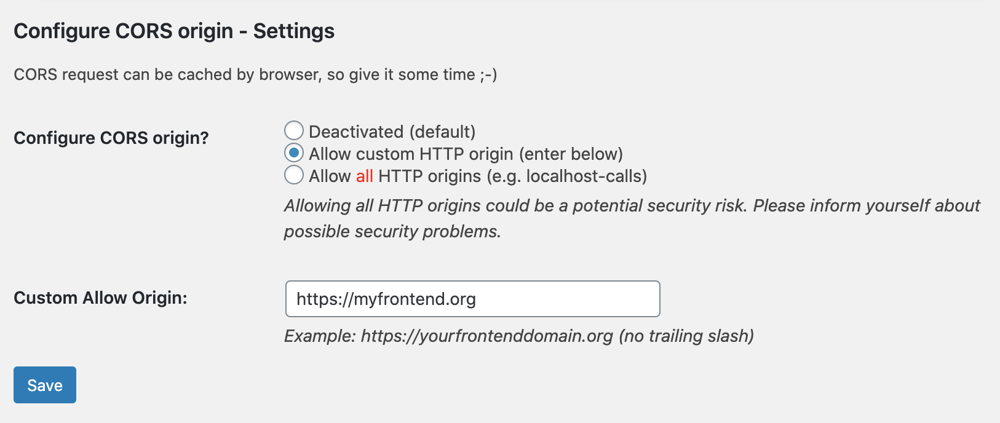

# WP Configure CORS origin
Configure allow-origin for REST calls from different domains for headless wordpress

State: Experimental, no warranty, don't use in production (without careful review)

Based on these tutorials

- https://dev.to/robmarshall/wordpress-rest-api-cors-issues-13p7
- https://thoughtsandstuff.com/wordpress-rest-api-cors-issues/

## Issues / TODOs:

- Support "https://frontendomain.org" as well als "https://www.frontenddomain.org"
- What about multiple allowed origins?
- Is it better to set this via .htaccess? (Performance?)
- Compare this solution to solutions implemented in
  - https://wordpress.org/plugins/jwt-authentication-for-wp-rest-api/
  - https://wordpress.org/plugins/simple-jwt-login/ (has enable CORS option page)
  - https://de.wordpress.org/plugins/wp-rest-api-authentication/
